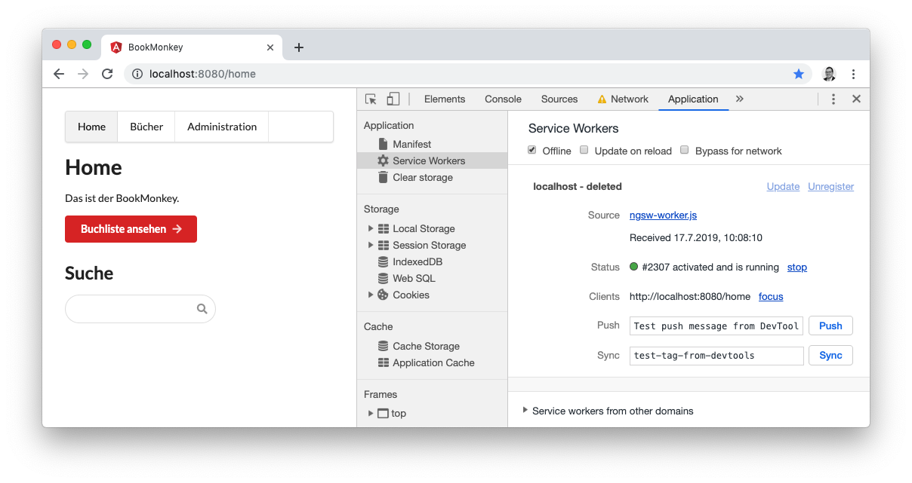

# BookMonkey3 PWA

This project is based on the [BookMonkey3 (iteration7, i18n)](https://github.com/book-monkey3/iteration-7-i18n).

## Build and serve the PWA

To build the PWA, run the build in production mode: `ng build --prod`. After that you can serve the production ready app using the `angular-http-server`:

```bash
npm i -g angular-http-server
angular-http-server --path=dist/BookMonkey
```

> Please be aware to use icognito tabs during development for testing the PWA, to be sure that you won't see cached data when changing the PWA's behaviour and loading the app in the browser.

You can use the Chrome Developer Tools to simulate an offline behaviour.




## Development server

Run `ng serve` for a dev server. Navigate to `http://localhost:4200/`. The app will automatically reload if you change any of the source files.

## Code scaffolding

Run `ng generate component component-name` to generate a new component. You can also use `ng generate directive|pipe|service|class|guard|interface|enum|module`.

## Build

Run `ng build` to build the project. The build artifacts will be stored in the `dist/` directory. Use the `--prod` flag for a production build.

## Running unit tests

Run `ng test` to execute the unit tests via [Karma](https://karma-runner.github.io).

## Running end-to-end tests

Run `ng e2e` to execute the end-to-end tests via [Protractor](http://www.protractortest.org/).

## Further help

To get more help on the Angular CLI use `ng help` or go check out the [Angular CLI README](https://github.com/angular/angular-cli/blob/master/README.md).
